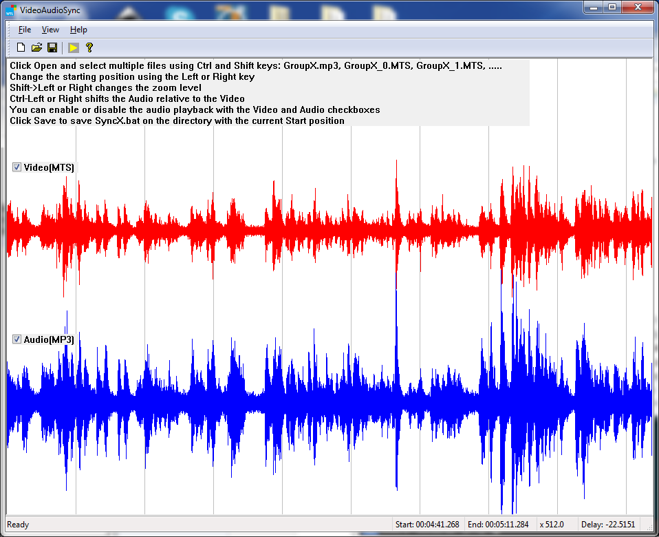

# Video Audio Sync for FFMPEG
For high audio quality, sound is separately recorded with an audio recorder when video is taken. So, it is necessary to synchronize the video with the audio. This application reads multiple MTS (common camcorder recording format) and a MP3 file using FFMPEG library and and present them as wave forms for easier alignment. The audio is played with SDL2 library. Using left and right arrow keys with the combination of Ctrl and Shift keys, users can zoom in and out and shift the audio relative to the video.

### A short instruction
1. Click Open and select multiple files using Ctrl and Shift keys: GroupX.mp3, GroupX_0.MTS, GroupX_1.MTS, .....
2. Change the starting position using the Left or Right key
3. Shift->Left or Right changes the zoom level
4. Ctrl-Left or Right shifts the Audio relative to the Video
5. You can enable or disable the audio playback with the Video and Audio checkboxes
6. Click Save to save SyncX.bat on the directory with the current Start position
7. Run Sync1.bat to run a ffmpeg command. The command combines multiple MTS file and a mp3 file and produces a combined synchronized MTS file.

